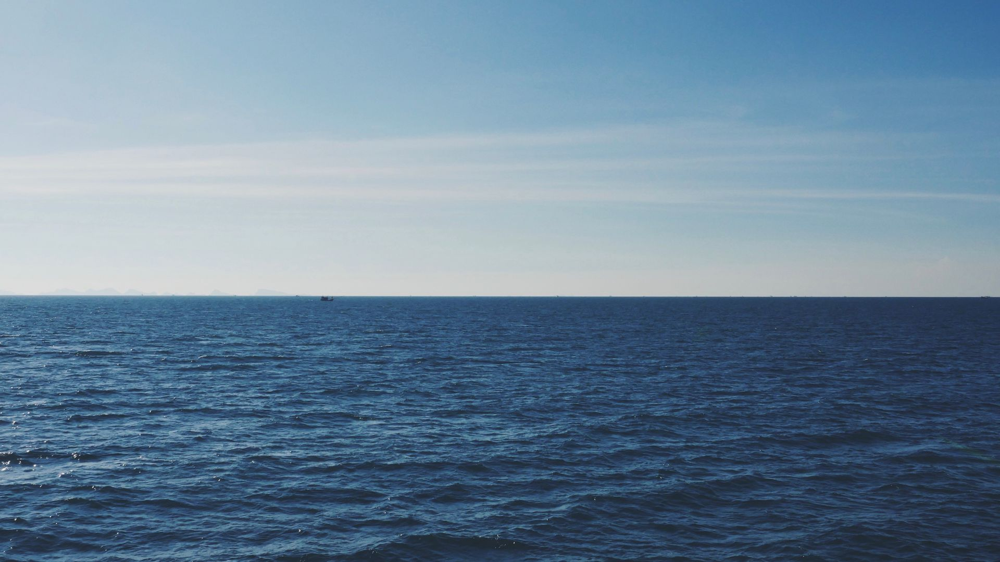

# 🌆 My Wallpapers Collection

This is a repository of my favorite wallpapers.

## 📥 Download this repo
``` bash
git clone --depth=1 https://github.com/ViegPhunt/Wallpaper-Collection.git
```

## 🔗 Image Sources
Here are some of the websites or communities where I found the wallpapers:
- [Reddit - r/unixporn](https://www.reddit.com/r/unixporn/)
- [Reddit - r/wallpaper](https://www.reddit.com/r/wallpaper/)
- [Reddit - r/wallpapers](https://www.reddit.com/r/wallpapers/)
- [Walls Catppuccin Mocha](https://github.com/orangci/walls-catppuccin-mocha)
- [Freepik](https://www.freepik.com/)
- [Wallpaperflare](https://www.wallpaperflare.com/)
- [Wallhaven](https://wallhaven.cc/)
- [Unsplash](https://unsplash.com/)
- [AlphaCoders](https://wall.alphacoders.com/)

## 🖼️ Preview




